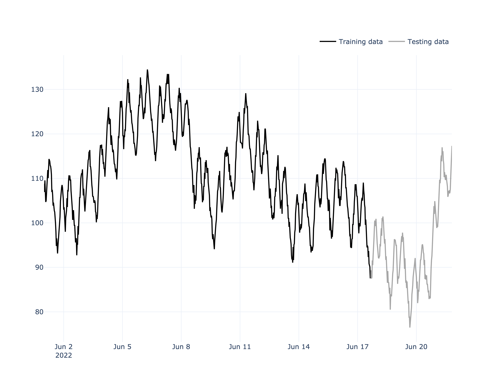
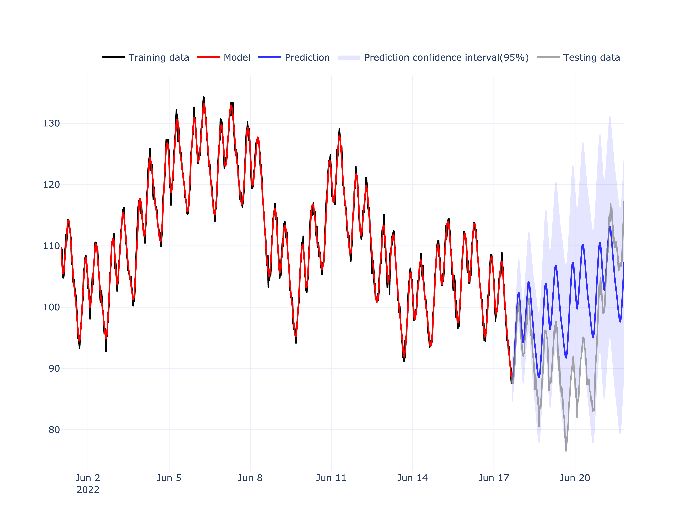
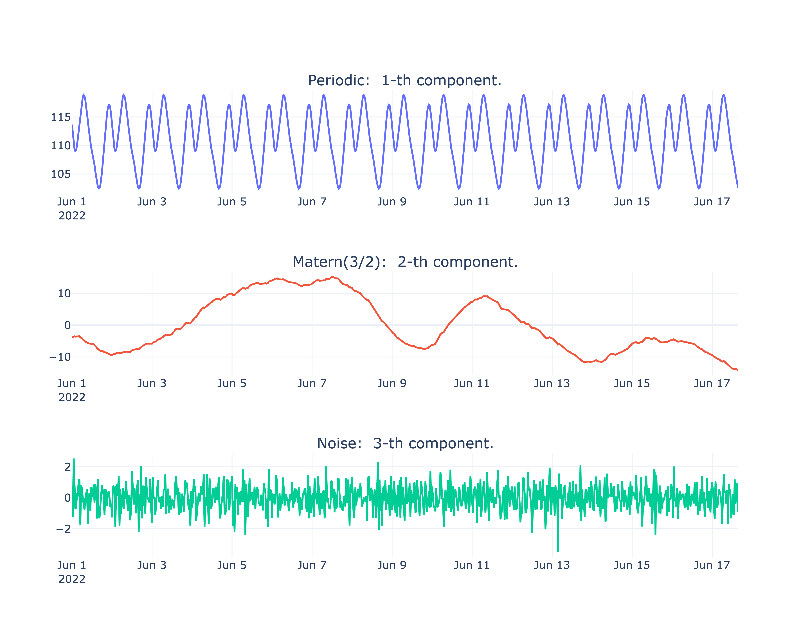
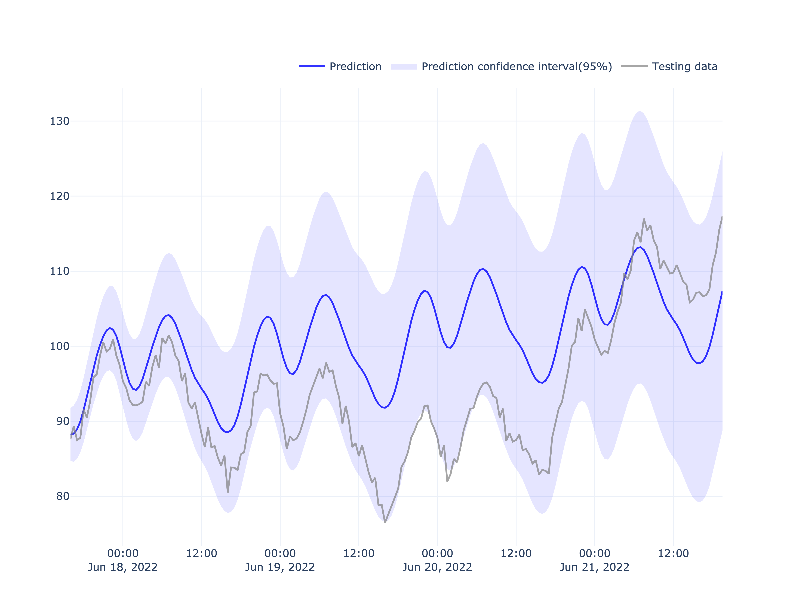
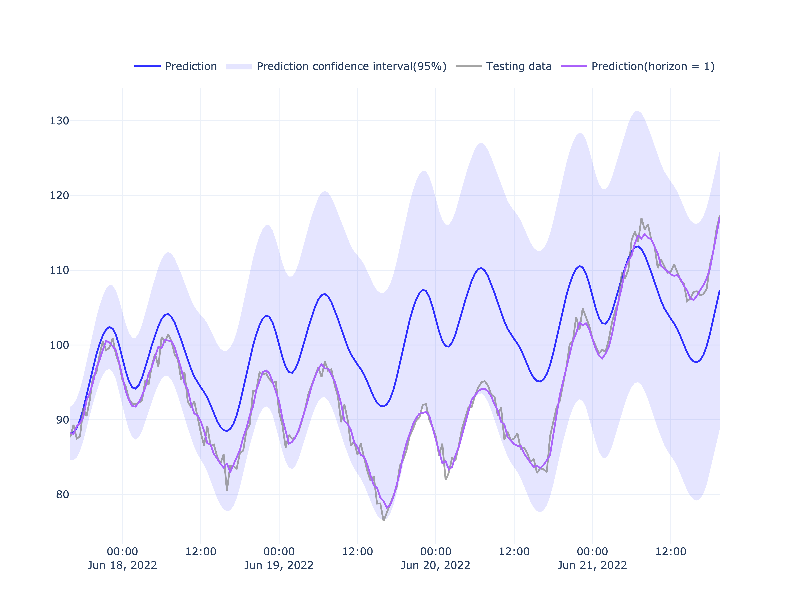
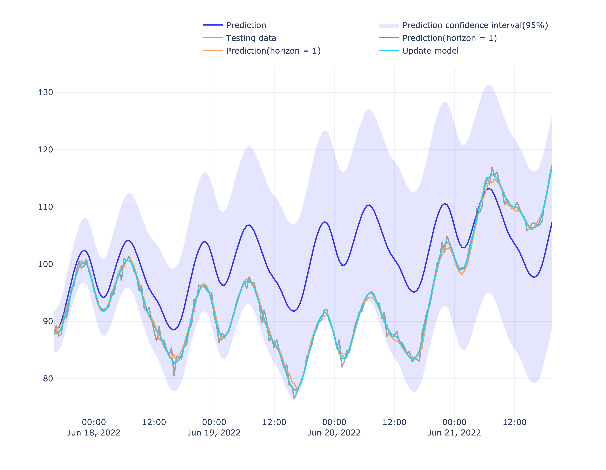

  

<!-- 

-->


<!-- 

-->

  
  

MakePrediction is a package for building an automatic Gaussian process regression (GPR) models for time series prediction in Python. It was originally created by [Hanany Tolba].

* MakePrediction is an open source project. If you have relevant skills and are interested in contributing then please do contact us (hananytolba@yahoo.com).*

  

Gaussian process regression (GPR):

==========================================

The advantages of this Gaussian processes package:

* Very fast training.

* Very fast prediction.

* The prediction can be interpolated as desired.

* The training of the model is automatic: 
            -   *no kernel function needs to be specified*
            -   *an optimal choice of kernel is automatically elaborated.*

* Possibility to choose a kernel function manually.

* The prediction is probabilistic (Gaussian) so that confidence intervals can be calculated and used to decide whether to make a strategic decision.

* The package provides an API for deployment.

  

## Where do you find time series?

* Energy

* Finance

* Medical, Biotech, and Healthcare

* IoT Monitoring

* Supply Chain

* Agriculture

* Retail

  
  

## What does makeprediction do?

* Modelling and analysis time series.

* Automatic time-series prediction (forecasting).

* Real-Time time series prediction.

* Deploy on production the fitted (or saved) makeprediction model.

  

### Applications:

* Energy consumption prediction.

* Energy demand prediction.

* Stock price prediction.

* Stock market prediction.

* ...
## Install MakePrediction package 

### Latest release from PyPI


* pip install makeprediction

  

### Latest source from GitHub

  

*Be aware that the `master` branch may change regularly, and new commits may break your code.*

  

[MakePrediction GitHub repository](https://github.com/HananyTolba/MakePrediction.git), run:

  

* pip install .
*or*
* python setup.py install 


## Get Started with MakePrediction

### Example


  

Here is a simple example:

#### Data 
 

```python
import pandas as pd
import numpy as np
import plotly.graph_objects as go

from makeprediction.gpts import GaussianProcessTimeSerie
from makeprediction.kernels import RBF, White, Linear, Periodic, Matern
from makeprediction.visualization import Visualizer

  

#### generate a random noisy time series
###############################

date = pd.date_range(start  =  '2022/06',periods  =  1000, freq  =  '20T')

# As sum of some Gaussian kernels

# As sum of some Gaussian kernels

kernel =   RBF()  + Periodic()  +  White(variance  =  .01)

# add mean and variance
data = 100 +  10*kernel.simulate(date, seed  = np.random.seed(115))
## generate data without fixe np.random.seed
# data = 100 +  10*kernel.simulate(date)

# create a dataframe with data
df = pd.DataFrame(data  = data, index  = date, columns=['value'])
print(df.head())

# split time serie into train and test
TRAIN_SIZE =  int(.8*len(df))
df_train, df_test = df[:TRAIN_SIZE], df[TRAIN_SIZE:]
# Create an instance of the class GaussianProcessTimeSerie with train data:
#########################################
model =  GaussianProcessTimeSerie(df_train.index, df_train.value)
# Show train data with test data
Visualizer.iplot(model, df_test.index, df_test.value)

```




#### Train 

```python

# fit the model

model.fit()

```

  
#### Test (long term prediction)

We will first show a simple prediction without updating with new observations (in other words without ever using df_test.value). We can say that the prediction horizon is infinite.

```python


#predict with model and plot result

model.predict(df_test.index)

Visualizer.iplot(model, df_test.index, df_test.value)

  

```


  

```python
# Model components
#how the components of the model (decomposition)
fig3 = Visualizer.iplot_components(model,return_fig=True)
fig3.write_image("fig3.png",width = 900,height =700, scale = 5)
```
 

```python
#plot only test result

fig2 = Visualizer.iplot(model, df_test.index, df_test.value, return_fig=True, test_only=True)
fig2.write_image("fig2.png",width = 1400,height =700)
fig2.show()

  ```



#### Online prediction with horizon = 1

Contrary to the previous case, the horizon is 1. In other words, we predict a first value at a given time, then we will update the model by communicating this observation via the update method and so on (see codes). 

```python

  

# Online prediction with updating

ypred = np.empty(shape  = (0,))

ypred_std = np.empty(shape  = (0,))

for x,y in df_test.itertuples():

	# predict for x value

	yp,yp_std = model.predict(x,return_value  =  True)

	ypred = np.append(ypred,yp)

	ypred_std = np.append(ypred_std,yp_std)

	# update the model for (x,y)

	data = {'x_update': x, 'y_update': y}

	model.update(**data)


# Show new prediction

# Show new update prediction

fig2.add_trace(
    go.Scatter(
        x=df_test.index,
        y=ypred,
        mode="lines",
        name='Prediction(horizon = 1)',
        showlegend=True)
)

fig2.write_image("fig2_update_one_head.png",width = 900,height =700, scale = 5)

  


```

   


  

#### After updating, how to check?
  
Note that each time the model is updated with a new data 	data = {'x_update': x (time), 'y_update': y (value)}
or even data vector. The model learns this data and adjusts itself to become more and more efficient.

```python

#prediction of data already seen(updated)
yupdate, _ = model.predict(df_test.index,return_value = True)

fig2.add_trace(
    go.Scatter(
        x=df_test.index,
        y=ypred,
        mode="lines",
        name='Prediction(horizon = 1)',
        showlegend=True)
)


fig2.add_trace(
    go.Scatter(
        x=df_test.index,
        y=yupdate,
        mode="lines",
        name='Update model',
        showlegend=True)
)
fig2.show()
fig2.write_image("fig2_update.png",width = 900,height =700, scale = 5)


  

```
   

  
