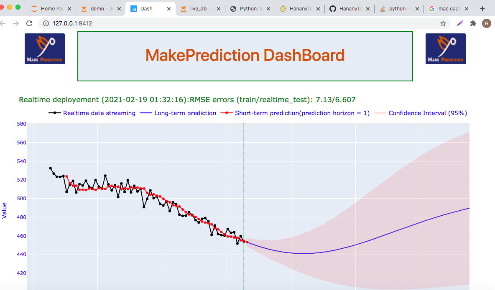

<!-- 
 -->

<!-- 
 -->


MakePrediction is a package for building an automatic Gaussian process regression (GPR) models for time series prediction in Python. It was originally created by [Hanany Tolba].
 
 * MakePrediction is an open source project. If you have relevant skills and are interested in contributing then please do contact us (hananytolba@yahoo.com).*

Gaussian process regression (GPR):
=====================================
The advantages of this Gaussian processes package:
* Very fast training.
* Very fast prediction.
* The prediction can be interpolated as desired. 
* The training of the model is automatic, no kernel function needs to be specified. An optimal choice of kernel is automatically elaborated.
* Possibility to choose a kernel function manually.
* The prediction is probabilistic (Gaussian) so that confidence intervals can be calculated and used to decide whether to make a strategic decision.  
* The package provides an API for deployment. 

   
## Where do you find time series?
* Energy
* Finance 
* Medical, Biotech, and Healthcare
* IoT Monitoring 
* Supply Chain
* Agriculture
* Retail


## What does makeprediction do?
* Modelling and analysis time series.
* Automatic time-series prediction (forecasting).
* Real-Time time series prediction.
* Deploy on production the fitted (or saved) makeprediction model.

### Applications:
* Energy consumption prediction. 
* Energy demand prediction.
* Stock price prediction.
* Stock market prediction.
* ...
### Latest release from PyPI

* pip install makeprediction

### Latest source from GitHub

*Be aware that the `master` branch may change regularly, and new commits may break your code.*

[MakePrediction GitHub repository](https://github.com/HananyTolba/MakePrediction.git), run:

* pip install .

Example
==========================

Here is a simple example:

```python
from makeprediction.quasigp import QuasiGPR as qgpr
from makeprediction.invtools import date2num
from makeprediction.kernels import *
import datetime
import pandas as pd
import numpy as np

#generate time series
###############################
  
x = pd.date_range(start = datetime.datetime(2021,1,1), periods=1000, freq = '3s' )
time2num = date2num(x)

# f(x)
f = lambda dt:  100*np.sin(2*np.pi*dt/500)*np.sin(2*np.pi*dt/3003)  + 500
# f(x) + noise
y = f(time2num) + 7*np.random.randn(x.size)

# split time serie into train and test
trainSize = int(x.size *.7)
xtrain,ytrain = x[:trainSize], y[:trainSize]
xtest,ytest = x[trainSize:], y[trainSize:]

# Create an instance of the class qgpr as model and plot it with plotly:
#########################################
model = qgpr(xtrain,ytrain, RBF()) 
model.plotly()
```


```python
#fit the model
model.fit()
```


```python
#predict with model and plot
model.predict(xtest)
model.plotly(ytest)
```


```python

#Online prediction with update
ypred = []
for i in range(xtest.size):
    yp,_ = model.predict(xtest[i],return_value = True)
    ypred.append(yp)
    data = {'x_update': xtest[i], 'y_update': ytest[i],}
    model.update(**data)


#plot 

import matplotlib.pyplot as plt
plt.figure(figsize = (10,5))
plt.plot(xtest,ytest,'b', label ='Test')
plt.plot(xtest,ypred,'r',label='Prediction')
plt.legend()
```


The previous prediction with updating, can be obtained simply by the "predict" method as follows:

```python
#prediction with update 
model.predict(xtest,ytest[:-1])
#And ploly 
model.plotly(ytest)
```


```python
# Errors of prediction
model.score(ytest)

{'train_errors': {'MAE': 5.525659848832947,
  'MSE': 48.75753482298262,
  'R2': 0.9757047695585449},
 'test_errors': {'MAE': 6.69916209795533,
  'MSE': 68.7186589422385,
  'R2': 0.9816696384584944}}
```

Save the model:
------------------
```python

model_path = 'saved_model'
model.save(model_path)
```


Deployement of makeprediction model
=========================================

Now we are going to simulate the behavior of data that arrives continuously  in realtime  and stored in a database. 
We will create a 'csv' file named 'live_db.csv' that automatically grows every 3 seconds with a new line.

Create a 'realtime_db.py' file and copy the following code into it  

```python
from makeprediction.ts_generation import rtts
import numpy as np
def func(t):
    f_t  = 100*np.sin(2*np.pi*t/500)*np.sin(2*np.pi*t/3003)  + 500  + 7*np.random.randn(1)[0]
    return f_t

if __name__ == '__main__':
    rtts(function = func,step = 3,filename = 'live_db.csv')
```


You can notice that the function 'func' is the same as the one that generates the time series that we have noted "f".

Now in a terminal type:
```bash
python realtime_db.py 
```
or 
```bash
python3 realtime_db.py 
```
or in a new Jupyter notepad

```jupyter-notebook
!python realtime_db.py 
```
according to your preference  

Load the model
--------------------

```python
from makeprediction.quasigp import QuasiGPR as qgpr
model_path = 'saved_model'
#load the model
loaded_model = qgpr()
loaded_model = loaded_model.load(model_path)
```

Deployement
---------------
```python

loaded_model.deploy2dashbord('live_db.csv')
```
```bash

Dash is running on http://127.0.0.1:9412/

INFO:makeprediction.quasigp:Dash is running on http://127.0.0.1:9412/

 * Serving Flask app "makeprediction.quasigp" (lazy loading)
 * Environment: production
   WARNING: This is a development server. Do not use it in a production deployment.
   Use a production WSGI server instead.
 * Debug mode: off
INFO:werkzeug: * Running on http://127.0.0.1:9412/ (Press CTRL+C to quit)
INFO:werkzeug:127.0.0.1 - - [18/Feb/2021 14:22:51] "POST /_dash-update-component HTTP/1.1" 200 -
INFO:werkzeug:127.0.0.1 - - [18/Feb/2021 14:22:51] "POST /_dash-update-component HTTP/1.1" 200 -
INFO:werkzeug:127.0.0.1 - - [18/Feb/2021 14:22:51] "POST /_dash-update-component HTTP/1.1" 200 -
```





Demo
---------
All  files of this demo are in the 'demos' directory.